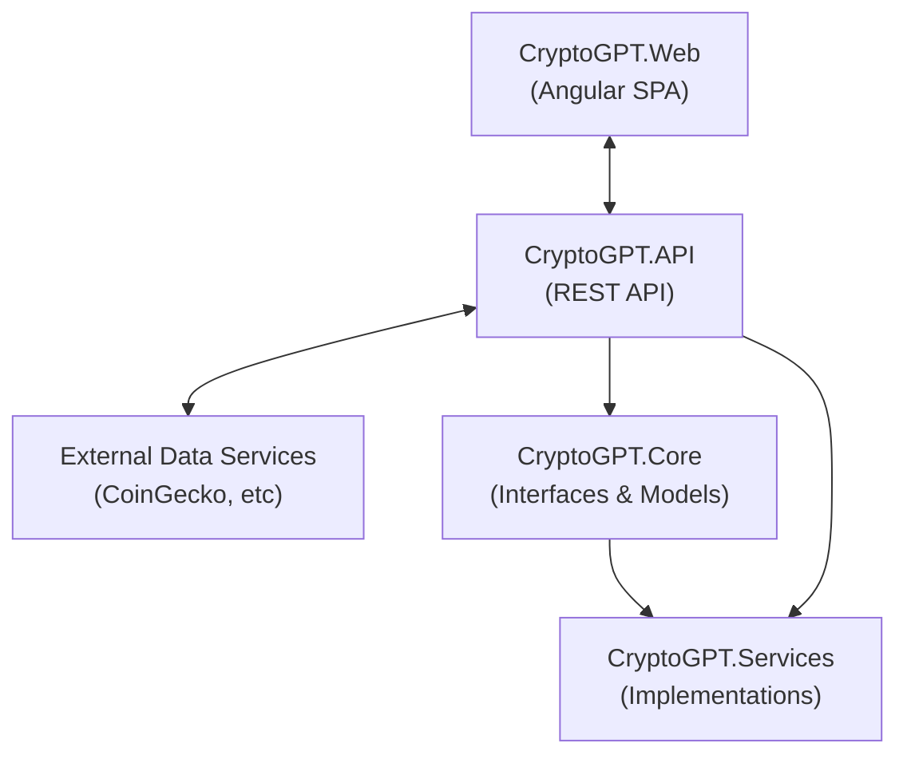
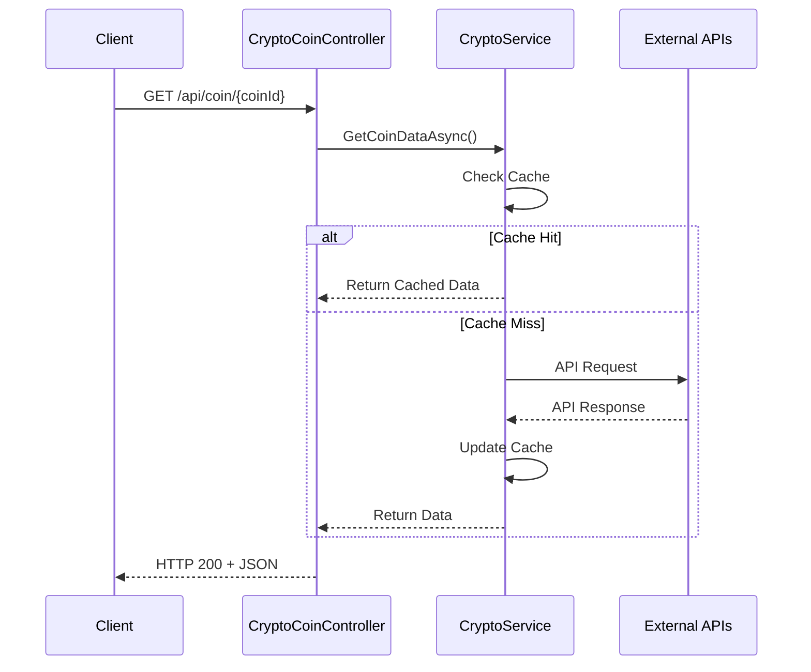
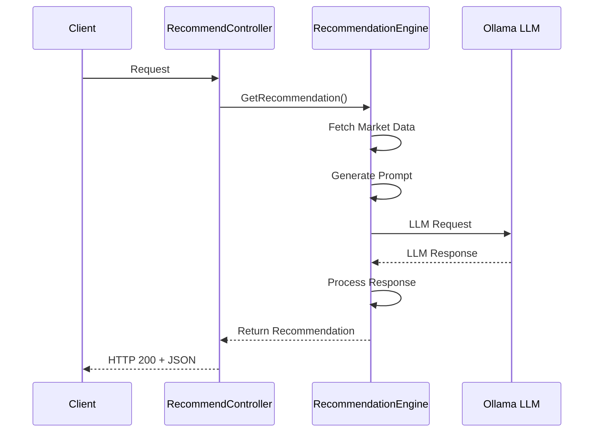
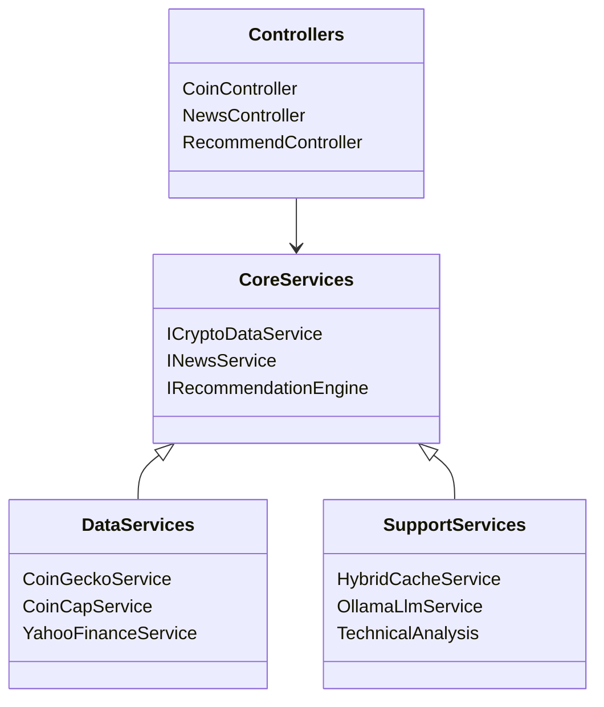

# CryptoGPT.Net

A comprehensive cryptocurrency data platform combining real-time market data, news aggregation, and AI-powered recommendations.

## Project Overview

CryptoGPT.Net is a .NET-based solution that integrates multiple cryptocurrency data sources with AI capabilities to provide market insights, technical analysis, and intelligent recommendations for cryptocurrency investors.

## Architecture

The project follows a clean architecture pattern with the following components:



### Key Components:

1. **CryptoGPT.API**: ASP.NET Core RESTful API exposing endpoints for cryptocurrency data
   - Controllers for coins, health, news, and recommendations
   - Uses Swagger for API documentation

2. **CryptoGPT.Core**: Contains interfaces and models shared across the solution
   - Data models for cryptocurrencies, news, market data
   - Interface definitions for all services

3. **CryptoGPT.Services**: Implements business logic and integrations
   - Multiple cryptocurrency data source adapters (CoinGecko, CoinCap, Yahoo Finance)
   - Caching strategies (Redis + Memory hybrid)
   - AI integration with Ollama LLM
   - News aggregation from crypto news sources

4. **CryptoGPT.Web**: Angular-based frontend for visualizing data
   - Market dashboards with ApexCharts
   - Bootstrap-based responsive UI
   - Server-side rendering capabilities

## Features

- **Multi-Source Data Integration**: Pulls from CoinGecko, CoinCap, and Yahoo Finance for robust data coverage
- **Hybrid Caching**: Uses both in-memory and Redis cache for performance optimization
- **AI-Powered Recommendations**: Leverages LLM models through Ollama for market insights
- **Technical Analysis**: Provides technical indicators and chart pattern recognition
- **News Aggregation**: Centralizes crypto news from multiple sources
- **Detailed Logging**: Comprehensive request/response logging with Serilog

## Technology Stack

| Component | Technology | Version | Purpose |
|-----------|------------|---------|---------|
| Backend API | ASP.NET Core | 8.0 | RESTful API services |
| Frontend | Angular | 17.3 | Single-page application |
| Cache | Redis | 6.0+ | Distributed caching |
| Cache | Memory Cache | - | In-memory caching |
| AI Model | Ollama LLM | - | Natural language processing |
| Documentation | Swagger/OpenAPI | 6.5.0 | API documentation |
| Logging | Serilog | 3.1.1 | Structured logging |
| Charts | ApexCharts | 1.10.0 | Data visualization |
| UI Framework | Bootstrap | 5.3.5 | Responsive design |
| HTTP Client | HttpClient | - | External API integration |

<!-- 
## Screenshots


*Main dashboard showing cryptocurrency market overview*


*Detailed view of a specific cryptocurrency with technical analysis*


*AI-generated investment recommendations*
-->

## Prerequisites

- .NET 8.0 SDK or later
- Redis server (optional, for distributed caching)
- Ollama LLM server (for AI-powered recommendations)
- Node.js and npm (for Angular frontend)

## Getting Started

### Backend Setup

1. **Clone the repository**
   ```bash
   git clone https://github.com/yourusername/CryptoGPT.Net.git
   cd CryptoGPT.Net
   ```

2. **Update configuration**
   
   Edit `CryptoGPT.API/appsettings.json` with your API keys and settings:
   ```json
   {
     "ConnectionStrings": {
       "Redis": "localhost:6379,connectTimeout=5000,syncTimeout=5000,abortConnect=false"
     },
     "NewsApiKey": "your-news-api-key",
     "CoinGeckoApiKey": "your-coingecko-api-key",
     "LlmSettings": {
       "DefaultModel": "llama2",
       "OllamaEndpoint": "http://localhost:11434"
     }
   }
   ```

3. **Start Redis** (optional, for distributed caching)
   ```bash
   docker run --name redis -p 6379:6379 -d redis
   ```

4. **Start Ollama server** (for AI recommendations)
   ```bash
   # Install Ollama following instructions at https://ollama.ai/
   ollama serve
   ollama pull llama2
   ```

5. **Build and run the API**
   ```bash
   dotnet build
   cd CryptoGPT.API
   dotnet run
   ```

   The API will be available at `https://localhost:5001` with Swagger UI at `https://localhost:5001/swagger`

### Frontend Setup

1. **Navigate to the web project**
   ```bash
   cd CryptoGPT.Web
   ```

2. **Install dependencies**
   ```bash
   npm install
   ```

3. **Start the Angular development server**
   ```bash
   npm start
   ```

   The web application will be available at `http://localhost:4200`

## API Endpoints

### Coin Data

- `GET /api/coin` - Get top cryptocurrencies by market cap
- `GET /api/coin/{coinId}` - Get detailed information for a specific coin
- `GET /api/coin/{coinId}/chart` - Get historical price data for charting

### News

- `GET /api/news` - Get latest cryptocurrency news
- `GET /api/news/{coinId}` - Get coin-specific news

### Recommendations

- `GET /api/recommendation/{coinId}` - Get AI-powered recommendations for a coin
- `GET /api/recommendation/portfolio` - Get portfolio optimization recommendations

### Health

- `GET /api/health` - Basic health check
- `GET /api/health/detailed` - Detailed system health information

For complete API documentation, see the [Swagger UI](https://localhost:5001/swagger) when the application is running.

## Sequence Diagrams

### Data Fetching Flow



### AI Recommendation Flow



## Class Diagram (UML)



<!--
## Deployment Options

### Docker Deployment

1. **Build Docker Images**

   ```bash
   # Build API Docker image
   docker build -t cryptogpt-api -f CryptoGPT.API/Dockerfile .
   
   # Build Angular frontend Docker image
   docker build -t cryptogpt-web -f CryptoGPT.Web/Dockerfile .
   ```

2. **Run with Docker Compose**

   Create a `docker-compose.yml` file:

   ```yaml
   version: '3'
   services:
     redis:
       image: redis:latest
       ports:
         - "6379:6379"
       volumes:
         - redis-data:/data
     
     ollama:
       image: ollama/ollama:latest
       ports:
         - "11434:11434"
       volumes:
         - ollama-data:/root/.ollama
     
     api:
       image: cryptogpt-api
       ports:
         - "5000:80"
         - "5001:443"
       depends_on:
         - redis
         - ollama
       environment:
         - ConnectionStrings__Redis=redis:6379
         - LlmSettings__OllamaEndpoint=http://ollama:11434
     
     web:
       image: cryptogpt-web
       ports:
         - "4200:80"
       depends_on:
         - api
   
   volumes:
     redis-data:
     ollama-data:
   ```

   Run with:
   ```bash
   docker compose up
   ```

### Azure Deployment

1. **Deploy API to Azure App Service**
   ```bash
   # Publish API
   dotnet publish CryptoGPT.API -c Release
   
   # Deploy to Azure
   az webapp up --sku F1 --name cryptogpt-api --resource-group cryptogpt-rg
   ```

2. **Deploy Angular app to Azure Static Web Apps**
   ```bash
   # Build Angular app
   cd CryptoGPT.Web
   npm run build --prod
   
   # Deploy using Azure Static Web Apps CLI
   swa deploy dist/crypto-gptweb --env production
   ```

## Performance Metrics

| Operation | Average Response Time | Cache Hit | Cache Miss |
|-----------|----------------------|-----------|-----------|
| Get Top Coins | 50ms | 250ms | 
| Get Coin Details | 30ms | 350ms |
| Get News | 40ms | 200ms |
| Get Recommendations | 250ms | 1500ms |

### System Requirements

**Minimum:**
- 2 CPU cores
- 4GB RAM
- 10GB disk space

**Recommended:**
- 4 CPU cores
- 8GB RAM
- 20GB disk space
- Redis instance with at least 1GB memory

## Development Workflow

### Branching Strategy

We follow a modified GitFlow workflow:
- `main` - Production code
- `develop` - Development branch
- `feature/*` - New features
- `bugfix/*` - Bug fixes
- `release/*` - Release preparation

### Coding Standards

This project follows the [Microsoft C# Coding Conventions](https://docs.microsoft.com/en-us/dotnet/csharp/fundamentals/coding-style/coding-conventions).

### Testing Strategy

- **Unit Tests**: Use xUnit for testing individual components
- **Integration Tests**: Test API endpoints with real dependencies
- **End-to-End Tests**: Use Cypress for Angular frontend testing

### Pull Request Process

1. Create a feature branch from `develop`
2. Implement changes with appropriate tests
3. Ensure all tests pass locally
4. Create a PR to merge into `develop`
5. PR requires at least one reviewer approval
6. PR must pass CI/CD checks before merging

## Troubleshooting

### Common Issues

1. **API returns 429 Too Many Requests**
   - **Cause**: API rate limits exceeded at data providers
   - **Solution**: Implement exponential backoff, rotate API keys, or consider premium API subscriptions

2. **Redis connection issues**
   - **Cause**: Redis server not running or connection string incorrect
   - **Solution**: Verify Redis is running and check connection string in appsettings.json

3. **Ollama LLM not responding**
   - **Cause**: Ollama service not running or model not loaded
   - **Solution**: Start Ollama server and ensure model is loaded with `ollama list`

4. **Slow API responses**
   - **Cause**: Cache misses or external API slowness
   - **Solution**: Check Redis cache health and optimize cache TTL settings

### Logs

Application logs are available at:
- API Logs: `CryptoGPT.API/Logs/log-YYYYMMDD.txt`
- Console output when running in development mode

## Roadmap

- [ ] Add user authentication and personalized portfolios
- [ ] Implement real-time price updates using WebSockets
- [ ] Add more advanced technical analysis indicators
- [ ] Develop mobile applications (iOS/Android)
- [ ] Add social sentiment analysis from Twitter/Reddit
- [ ] Implement historical backtesting of trading strategies
-->

## Key Technical Decisions

1. **Multi-source Data Strategy**: We use multiple cryptocurrency data sources with fallback mechanisms to ensure data availability and accuracy, automatically switching between sources when rate limits are encountered.

2. **Hybrid Caching**: The application uses a two-tiered caching strategy:
   - In-memory cache for frequent small requests
   - Redis for distributed caching of larger datasets and cross-instance sharing

3. **AI Integration**: Ollama LLM integration provides natural language processing capabilities for:
   - Interpreting market trends
   - Generating investment recommendations
   - Summarizing news impact on specific coins

4. **Comprehensive Logging**: All API calls (both internal and external) are logged with Serilog for troubleshooting and analytics.

## Contributing

1. Fork the repository
2. Create your feature branch (`git checkout -b feature/amazing-feature`)
3. Commit your changes (`git commit -m 'Add some amazing feature'`)
4. Push to the branch (`git push origin feature/amazing-feature`)
5. Open a Pull Request

## License

This project is licensed under the MIT License - see the LICENSE file for details.

## Acknowledgments

- [CoinGecko API](https://www.coingecko.com/en/api) for cryptocurrency market data
- [Ollama](https://ollama.ai/) for local LLM capabilities
- [ApexCharts](https://apexcharts.com/) for interactive charts